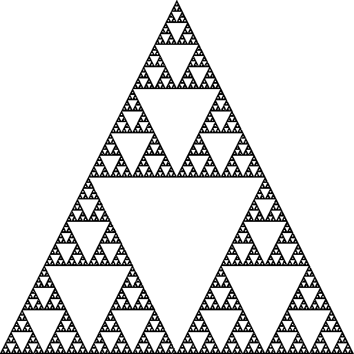
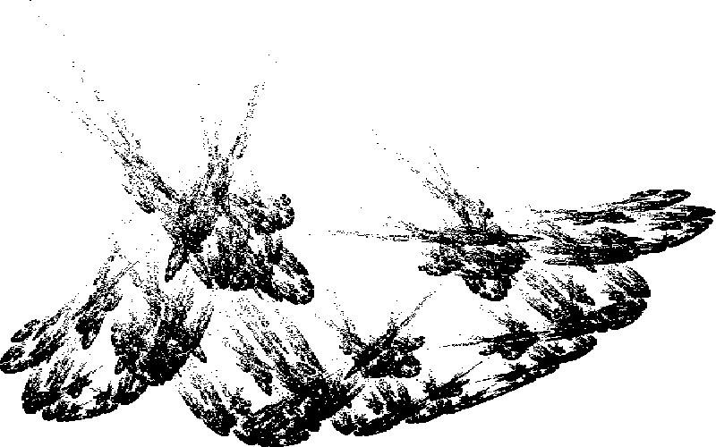
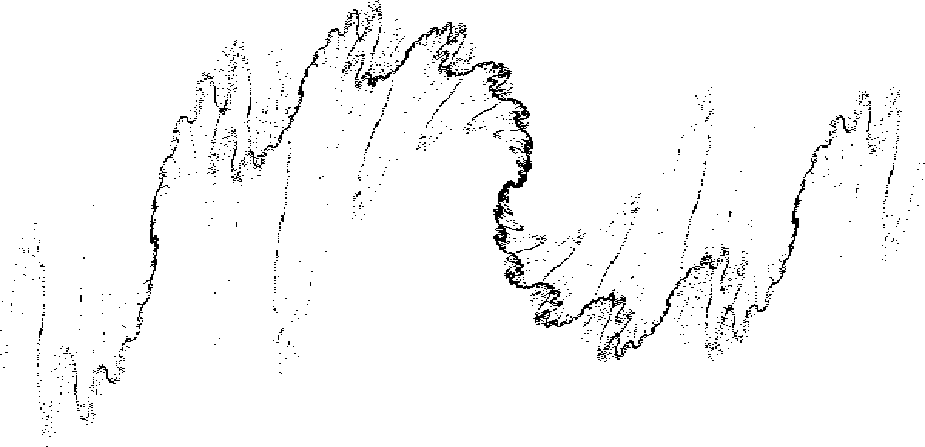
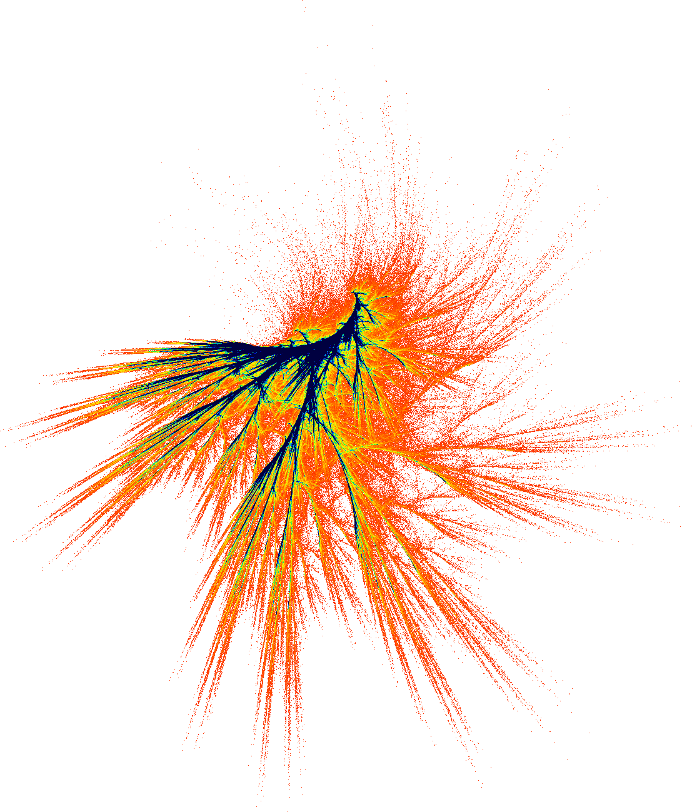

# Examples

## Barnsley Fern
### Code

```R
library(IFSPlot)

url_ifs = "https://gist.githubusercontent.com/cesandovalp/54549c7262d8deb2f80a1d4fb203fe12/raw/4bd5f6616c3ed088f1432fa97461addc410f7269/Fern2D.json"
result = RunJSONIFS2D(url_ifs, 0)

```
### Output


### Code
```R
library(IFSPlot)

url_ifs = "https://gist.githubusercontent.com/cesandovalp/54549c7262d8deb2f80a1d4fb203fe12/raw/4bd5f6616c3ed088f1432fa97461addc410f7269/Fern2D.json"
result = RunJSONIFS2D(url_ifs, 1)
```
### Output


## Sierpinski triangle
### Code
```R
library(IFSPlot)

url_ifs = "https://gist.githubusercontent.com/cesandovalp/54549c7262d8deb2f80a1d4fb203fe12/raw/efbbc0609c228b90c05ed21654aadd2a293ac026/Sierpinski2D.json"
result = RunJSONIFS2D(url_ifs, 0)

```
### Output


### Code
```R
library(IFSPlot)

url_ifs = "https://gist.githubusercontent.com/cesandovalp/54549c7262d8deb2f80a1d4fb203fe12/raw/01040f7cd0e90089f469869d5b5f5d9259ed6cd7/Sierpinski3D.json"
result = IFSPlot::RunJSONIFS3D(url_ifs, 866, 866, 0)

```

### Output (link to youtube video)
[](https://www.youtube.com/watch?v=bH61r6B4d2A)

## Random IFS
### Code

```R
library(IFSPlot)

transformations = list()
translations    = list()
probability     = c()

n_rules = ceiling(runif(1, 2, 5))

for(i in 1:n_rules) {
  transformations[[i]] = matrix(data = c(runif(1, -1, 1), runif(1, -1, 1), runif(1, -1, 1), runif(1, -1, 1)), nrow = 2, ncol = 2)
  translations[[i]]    = c(runif(1, -10, 10), runif(1, -1, 1))
  if(i < n_rules && sum(probability) < 100)
    probability = c(probability, ceiling(runif(1, 1, 100 - sum(probability))))
  else
    probability = c(probability, 100 - sum(probability))
}

iterations = 10**7

result = RunJSONIFS2D(transformations, translations, probability, iterations, 600*600)

#> transformations
#[[1]]
#           [,1]       [,2]
#[1,] -0.4306939 -0.3824292
#[2,] -0.8861779  0.2206868
#
#[[2]]
#           [,1]       [,2]
#[1,] -0.4247236 0.02783971
#[2,] -0.8051508 0.73832768
#
#[[3]]
#           [,1]       [,2]
#[1,] -0.0180402 -0.3716764
#[2,] -0.8905424  0.8767196
#
#> translations
#[[1]]
#[1] 5.428667 0.207256
#
#[[2]]
#[1] -7.0755932  0.9554882
#
#[[3]]
#[1] -4.3006790  0.1036099
#
#> probability
#[1] 83 11  6

```

### Output



### Code

```R
#[[1]]
#           [,1]        [,2]
#[1,] -0.7678027 -0.04480167
#[2,]  0.4884063 -0.79417768
#
#[[2]]
#           [,1]       [,2]
#[1,] -0.3808980 0.07212426
#[2,] -0.4468545 0.95750017
#
#> translations
#[[1]]
#[1]  6.8574590 -0.2493633
#
#[[2]]
#[1] 0.7330911 0.2557175
#
#> probability
# [1] 98  2

```

### Output



### Code

```R
library(IFSPlot)

transformations = list()
translations    = list()
probability     = c()

n_rules = ceiling(runif(1, 2, 5))

for(i in 1:n_rules) {
  transformations[[i]] = matrix(data = c(runif(1, -1, 1), runif(1, -1, 1), runif(1, -1, 1), runif(1, -1, 1)), nrow = 2, ncol = 2)
  translations[[i]]    = c(runif(1, -10, 10), runif(1, -1, 1))
  if(i < n_rules && sum(probability) < 100)
    probability = c(probability, ceiling(runif(1, 1, 100 - sum(probability))))
  else
    probability = c(probability, 100 - sum(probability))
}

iterations = 10**7

result = RunJSONIFS2D(transformations, translations, probability, iterations, 600*600, 2)

#> transformations
#[[1]]
#            [,1]      [,2]
#[1,]  0.66640006 0.4746569
#[2,] -0.04795423 0.4930780
#
#[[2]]
#          [,1]       [,2]
#[1,] 0.5868358 -0.6407019
#[2,] 0.9718777  0.6517174
#
#[[3]]
#          [,1]       [,2]
#[1,] 0.3972159 -0.2148658
#[2,] 0.3573538  0.3081989
#
#> translations
#[[1]]
#[1] -8.993093 -2.422015
#
#[[2]]
#[1] -8.787602 -4.981803
#
#[[3]]
#[1] 1.562586 9.455961
#
#> probability
#[1] 63 21 16

```

### Output



## 200 Random 3D IFS

### Output (link to youtube video)
[](https://www.youtube.com/watch?v=44zyGDYo2VM)
